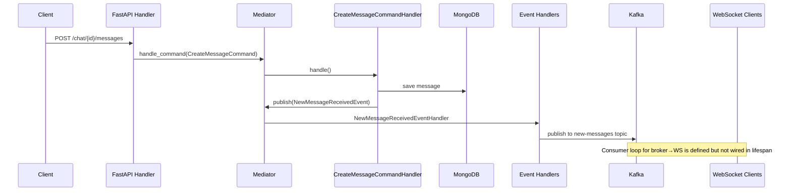

## What This Project Is

**Simple Kafka Chat** is an educational/reference FastAPI application that implements a multi-user chat backend using **Domain-Driven Design (DDD)**, **CQRS**, and **event-driven architecture** with **Apache Kafka**. Chats and messages are persisted in **MongoDB**, clients can subscribe to live updates over **WebSockets**, and there is groundwork for **Telegram** notifications when listeners are added to a chat.

---

## Technology Stack


| Layer                    | Technology                            |
| ------------------------ | ------------------------------------- |
| **Language**             | Python 3.11+ (Docker image uses 3.12) |
| **Web framework**        | FastAPI, Uvicorn, Starlette           |
| **Persistence**          | MongoDB via Motor (async)             |
| **Messaging**            | Apache Kafka via aiokafka             |
| **Real-time**            | WebSockets (`websockets` library)     |
| **Validation / config**  | Pydantic, pydantic-settings           |
| **Serialization**        | orjson                                |
| **Dependency injection** | punq                                  |
| **Packaging**            | Poetry                                |
| **Containers**           | Docker, Docker Compose                |
| **Testing**              | pytest, pytest-asyncio, Faker, httpx  |
| **Code quality**         | pre-commit, Ruff, isort, pyupgrade    |


**Infrastructure services (Docker Compose):**

- MongoDB (single-node replica set) + Mongo Express (admin UI on port 28081)
- Kafka + Zookeeper + Kafka UI (port 8090)
- FastAPI app (port from `API_PORT` in `.env`)
- Prometheus (port from `PROMETHEUS_PORT` in `.env`)

---


## Architecture

The codebase follows a layered, DDD-style layout:

```
app/
├── application/     # HTTP/WebSocket API (FastAPI routers, schemas)
├── domain/          # Entities, value objects, domain events, exceptions
├── logic/           # Commands, queries, event handlers, Mediator
├── infrastructure/  # MongoDB repos, Kafka broker, WebSocket manager, Telegram
├── settings/        # Environment-based configuration
└── test/            # Unit and API tests
```


### Core patterns

1. **CQRS + Mediator** — HTTP handlers delegate to a `Mediator` that routes **commands** (writes), **queries** (reads), and **domain events** (side effects).
2. **Rich domain model** — `Chat` and `Message` entities register domain events (`NewChatCreatedEvent`, `NewMessageReceivedEvent`, etc.) when state changes.
3. **Event publishing** — After persistence, command handlers call `mediator.publish()` to trigger event handlers that push to Kafka and/or WebSocket clients.
4. **Dependency injection** — `punq` container in `logic/init.py` wires repositories, Kafka, WebSocket manager, and the mediator.

### Transaction Outbox & Relay

Writes are made **atomic with their event emissions** using the [Transaction Outbox](https://microservices.io/patterns/data/transactional-outbox.html) pattern:

1. A command handler opens a MongoDB transaction (`ClientSession` → `start_transaction`), writes the business document **and** an outbox row (via `BaseOutboxRepository`) in the same transaction, then commits.
2. A background **relay worker** (`infrastructure/outbox/relay.py`, driven by `aiojobs`) polls the `outbox` collection for unsent rows and publishes each row's payload to its Kafka topic.
3. After a row is delivered, the relay marks it sent. Delivery is **at-least-once** — a crash between send and mark may re-send a row once; downstream consumers dedupe on the stable `event_id` key.

This decouples write latency from Kafka availability: a Kafka outage only delays delivery, it never drops events. The event handlers under `logic/events/messages.py` now write to the outbox instead of sending to Kafka directly.

> ⚠️ **MongoDB must run as a single-node replica set** for transactions to work. The compose stack starts Mongo with `--replSet rs0` and a one-shot `init-mongo` service runs `rs.initiate()`. The connection URI in `.env` must include `?replicaSet=rs0`.

### Observability (Prometheus)

`/metrics` is exposed on the app (HTTP `*_requests`/`*_requests_duration` from `prometheus-fastapi-instrumentator`) plus custom outbox/Kafka counters defined in `infrastructure/metrics.py`:

- `outbox_published_total` — rows forwarded to Kafka by the relay
- `outbox_publish_errors_total` — relay send failures
- `outbox_pending` — rows currently unsent in the outbox
- `kafka_messages_sent_total` — messages the relay sent to Kafka

Run `make prometheus` to bring up a Prometheus container that scrapes `main-app:8000/metrics` (UI at `:${PROMETHEUS_PORT}`).


### Request flow (create message)




---


## Project Structure (detailed)

```
fastapi_examples/
├── app/
│   ├── application/api/          # FastAPI entrypoint, routes, WebSockets
│   ├── domain/                   # DDD core (entities, events, values)
│   ├── infrastructure/           # Adapters (Mongo, Kafka, WS, Telegram)
│   ├── logic/                    # Application services (CQRS + mediator)
│   ├── settings/                 # Config
│   ├── test/                     # Tests
│   ├── kafka_test_producer.py    # Kafka smoke-test script
│   └── kafka_test_consumer.py    # Kafka smoke-test script
├── docker_compose/
│   ├── app.yaml
│   ├── storages.yaml
│   └── kafka.yaml
├── Dockerfile
├── Makefile
├── pyproject.toml
└── poetry.lock
```

---


## API Reference

Base URL: `http://localhost:{API_PORT}`  
Interactive docs: `/api/docs`

### REST — prefix `/chat`


| Method   | Path                          | Description                                     |
| -------- | ----------------------------- | ----------------------------------------------- |
| `POST`   | `/chat/`                      | Create a chat (unique title, max 255 chars)     |
| `GET`    | `/chat/`                      | List chats (pagination via filters)             |
| `GET`    | `/chat/{chat_oid}/`           | Get chat details                                |
| `DELETE` | `/chat/{chat_oid}/`           | Soft-delete chat; disconnects WebSocket clients |
| `POST`   | `/chat/{chat_oid}/messages`   | Send a message                                  |
| `GET`    | `/chat/{chat_oid}/messages/`  | List messages in a chat                         |
| `POST`   | `/chat/{chat_oid}/listeners/` | Add Telegram listener to chat                   |
| `GET`    | `/chat/{chat_oid}/listeners/` | List chat listeners                             |


### WebSocket — prefix `/chats`


| Path                    | Description                             |
| ----------------------- | --------------------------------------- |
| `WS /chats/{chat_oid}/` | Connect to a chat room for live updates |


On connect, the server validates the chat exists, accepts the connection, and sends `"You are now connected!"`. When a chat is deleted, connected clients receive `{"message": "Chat has been deleted"}` and are disconnected.

---


## Domain Model

**Entities:**

- `Chat` — title, messages, listeners, soft-delete flag
- `Message` — text + chat reference
- `ChatListener` — external listener (e.g. Telegram chat ID)

**Value objects:**

- `Title` — non-empty, max 255 characters
- `Text` — non-empty message body

**Domain events (published to Kafka):**


| Event                     | Kafka topic (default)  |
| ------------------------- | ---------------------- |
| `NewChatCreatedEvent`     | `new-chats-topic`      |
| `NewMessageReceivedEvent` | `new-messages`         |
| `ChatDeletedEvent`        | `chat-deleted-topic`   |
| `ListenerAddedEvent`      | `listener-added-topic` |


---


## Configuration

Settings are loaded from environment variables via `settings/config.py`:


| Variable                      | Default                   | Purpose                 |
| ----------------------------- | ------------------------- | ----------------------- |
| `MONGO_DB_CONNECTION_URI`     | `mongodb://mongodb:27017` | MongoDB connection      |
| `MONGODB_CHAT_DATABASE`       | `chat`                    | Database name           |
| `MONGODB_CHAT_COLLECTION`     | `chat`                    | Chats collection        |
| `MONGODB_MESSAGES_COLLECTION` | `messages`                | Messages collection     |
| `kafka_url`                   | `kafka:29092`             | Kafka bootstrap servers |
| `new_chats_event_topic`       | `new-chats-topic`         | Topic for new chats     |
| `new_message_received_topic`  | `new-messages`            | Topic for new messages  |
| `chat_deleted_topic`          | `chat-deleted-topic`      | Topic for deleted chats |
| `new_listener_added_topic`    | `listener-added-topic`    | Topic for new listeners |
| `MONGODB_OUTBOX_COLLECTION`   | `outbox`                    | Outbox collection (relay source) |
| `OUTBOX_RELAY_POLL_INTERVAL`  | `1.0`                       | Seconds between relay polls |
| `PROMETHEUS_PORT`             | `9090`                      | Prometheus server port (Docker) |
| `API_PORT`                    | (required in Docker)      | Host port for the app   |


Additional `.env` variables used by Docker Compose:

- `MONGO_DB_ADMIN_USERNAME`, `MONGO_DB_ADMIN_PASSWORD` — Mongo Express auth

---


## Getting Started


### Prerequisites

- Docker & Docker Compose
- Poetry (for local development)
- Make (optional, for convenience targets)


### 1. Create `.env`

Example:

```env
API_PORT=8000
MONGO_DB_ADMIN_USERNAME=admin
MONGO_DB_ADMIN_PASSWORD=admin
MONGO_DB_CONNECTION_URI=mongodb://mongodb:27017?replicaSet=rs0
PROMETHEUS_PORT=9090
```


### 2. Start infrastructure and app

```bash
# All services (MongoDB, Kafka, app)
make all

# Or individually:
make storages   # MongoDB + Mongo Express
make kafka      # Kafka + Zookeeper + Kafka UI
make app        # FastAPI application
```


### 3. Access services


| Service       | URL                                                              |
| ------------- | ---------------------------------------------------------------- |
| API docs      | [http://localhost:8000/api/docs](http://localhost:8000/api/docs) |
| Mongo Express | [http://localhost:28081](http://localhost:28081)                 |
| Kafka UI      | [http://localhost:8090](http://localhost:8090)                   |
| Prometheus    | [http://localhost:9090](http://localhost:9090)                   |


### 4. Local development (without Docker)

```bash
poetry install
poetry run uvicorn --factory application.api.main:create_app --reload --host 0.0.0.0 --port 8000
```

Run from the `app/` directory or ensure `app/` is on `PYTHONPATH`. MongoDB and Kafka must be reachable at the configured URLs.

### 5. Run tests

```bash
poetry run pytest
```

Tests use in-memory repositories (see `app/test/` fixtures).

### 6. Pre-commit hooks

```bash
poetry run pre-commit install
poetry run pre-commit run --all-files
```

---


## Makefile Commands


| Target           | Action                          |
| ---------------- | ------------------------------- |
| `make all`       | Start storages + app + Kafka + Prometheus |
| `make app`       | Start FastAPI container         |
| `make storages`  | Start MongoDB replica-set stack |
| `make kafka`     | Start Kafka stack               |
| `make prometheus`| Start Prometheus + scrape config |
| `make all-down`  | Stop everything                 |
| `make app-shell` | Shell into `main-app` container |
| `make app-logs`  | Follow app logs                 |
| `make prometheus-logs` | Follow Prometheus logs     |


