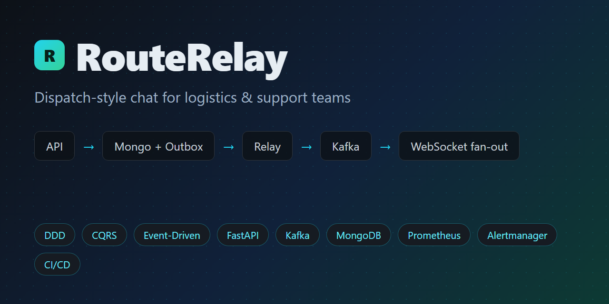
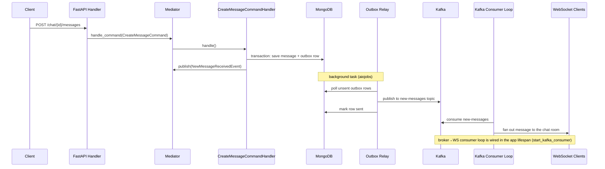

# RouteRelay — dispatch-style chat for logistics teams · FastAPI · Kafka · MongoDB (DDD + CQRS)

[](https://github.com/M0ng00se7169/RouteRelay/actions/workflows/ci.yml)
[](https://github.com/M0ng00se7169/RouteRelay/actions/workflows/cd.yml)

## What This Project Is

**RouteRelay** is a FastAPI application that implements a dispatch-style coordination chat for logistics and support teams — one chat room per route, order, or incident — using **Domain-Driven Design (DDD)**, **CQRS**, and **event-driven architecture** with **Apache Kafka**. Chats and messages are persisted in **MongoDB**, clients subscribe to live updates over **WebSockets**, and external listeners (e.g. Telegram) get notified when added to a chat.

---

## Engineering Highlights — the CI/CD story, end to end



Everything in this repository is wired the way a production team would run it: the same quality
gates locally and in CI, a merge publishes a pinned image, and a bad release rolls back in
seconds without a rebuild. Follow the trail:

| Step | What happens | Where to look |
|---|---|---|
| **1 · Push / PR** | Five CI jobs run on every push and pull request: the repo's own pre-commit suite (lint), a strict `mypy` type check over the whole app package, the full pytest suite (self-contained — no services needed), `promtool` + `amtool` validation of the Prometheus/Alertmanager configs, and a Buildx image build | [CI runs](https://github.com/M0ng00se7169/RouteRelay/actions/workflows/ci.yml) · [workflow](.github/workflows/ci.yml) |
| **2 · Merge to `main`** | CD waits for the CI run on the *same commit* to pass (tests **and** type check), then builds and pushes the image to GitHub Container Registry — tagged `latest` plus the immutable commit SHA, authenticated with the built-in `GITHUB_TOKEN` (no PATs) | [CD runs](https://github.com/M0ng00se7169/RouteRelay/actions/workflows/cd.yml) · [workflow](.github/workflows/cd.yml) · [packages](https://github.com/M0ng00se7169?tab=packages) |
| **3 · Deploy** | `main-app` runs from the pinned GHCR tag via a deploy-specific compose file (no dev bind-mount, no `--reload`, no rebuild — compose's override merge cannot remove keys, so the file *replaces* the service) | [deploy & rollback runbook](docs/runbooks/deploy-and-rollback.md) |
| **4 · Roll back** | Pin the previous good `APP_IMAGE=<sha>` in `.env`, re-run `up` — done in seconds, no `git revert`, no rebuild; the app is stateless by design (transactional outbox), so Mongo/Kafka/Alertmanager state survives the swap | [runbook → rollback](docs/runbooks/deploy-and-rollback.md) |

The observability stack is part of the same story, not an afterthought: 6 alert rules, every one
linked to a written runbook (`docs/runbooks/`), validated in CI so a malformed rule can't reach
the live Prometheus — and the alerting design decisions are recorded in
[ADR-0006](docs/adr/0006-metrics-implementation-plan.md) (metrics + rules, calibrated by a
Locust load test) and [ADR-0007](docs/adr/0007-alertmanager-wiring.md) (Alertmanager routing,
inhibition pairs, Telegram transport, silencing procedure).

---

## Technology Stack


| Layer                    | Technology                            |
| ------------------------ | ------------------------------------- |
| **Language**             | Python 3.11+ (Docker image uses 3.12) |
| **Web framework**        | FastAPI, Uvicorn, Starlette           |
| **Persistence**          | MongoDB via Motor (async)             |
| **Messaging**            | Apache Kafka via aiokafka             |
| **Cache / ephemeral**    | Valkey via valkey-py (cache-aside, presence, relay lock) |
| **Real-time**            | WebSockets (`websockets` library)     |
| **Validation / config**  | Pydantic, pydantic-settings           |
| **Serialization**        | orjson                                |
| **Dependency injection** | punq                                  |
| **Packaging**            | uv                                    |
| **Containers**           | Docker, Docker Compose                |
| **Testing**              | pytest, pytest-asyncio, Faker, httpx  |
| **Code quality**         | pre-commit, Ruff, isort, pyupgrade    |


**Infrastructure services (Docker Compose):**

- MongoDB (single-node replica set) + Mongo Express (admin UI on port 28081)
- Kafka + Zookeeper + Kafka UI (port 8090)
- Valkey (port from `VALKEY_PORT` in `.env`; cache-aside, chat presence, outbox relay lock —
  every feature is behind a flag that defaults **off** in the app and **on** in the compose `.env`)
- FastAPI app (port from `API_PORT` in `.env`)
- Prometheus (port from `PROMETHEUS_PORT` in `.env`)
- Loki + Promtail (log aggregation, Loki port from `LOKI_PORT` in `.env`)
- Grafana (dashboards, port from `GRAFANA_PORT` in `.env`)

---


## Architecture

The codebase follows a layered, DDD-style layout:

```
fastapi_examples/
├── app/                 # layered DDD layout — see "Architecture" below
│   ├── application/     # HTTP/WebSocket API (FastAPI routers, schemas)
│   ├── domain/          # Entities, value objects, domain events, exceptions
│   ├── logic/           # Commands, queries, event handlers, Mediator
│   ├── infrastructure/  # MongoDB repos, Kafka broker, WebSocket manager, Telegram
│   ├── settings/        # Environment-based configuration
│   └── test/            # Unit and API tests                         
├── docker_compose/
│   ├── app.yaml
│   ├── storages.yaml
│   ├── kafka.yaml
│   ├── prometheus.yaml
│   ├── observability.yaml        # Loki + Promtail + Grafana
│   ├── loki/loki-config.yaml
│   ├── promtail/promtail-config.yaml
│   └── grafana/provisioning/     # datasources + kafka-chat-overview dashboard
├── loadtest/                     # Locust load-test harness
├── Dockerfile
├── Makefile
├── prometheus.yml
├── pyproject.toml
└── uv.lock
```

---


### Core patterns

1. **CQRS + Mediator** — HTTP handlers delegate to a `Mediator` that routes **commands** (writes), **queries** (reads), and **domain events** (side effects).
2. **Rich domain model** — `Chat` and `Message` entities register domain events (`NewChatCreatedEvent`, `NewMessageReceivedEvent`, etc.) when state changes.
3. **Event publishing** — After persistence, command handlers call `mediator.publish()` to trigger in-process event handlers (e.g. the WebSocket disconnect on chat deletion); **Kafka delivery goes through the Transaction Outbox relay** (see below), and the broker→WebSocket consumer loop fans messages out to chat clients.
4. **Dependency injection** — `punq` container in `logic/init.py` wires repositories, Kafka, WebSocket manager, and the mediator.

### Transaction Outbox & Relay

Writes are made **atomic with their event emissions** using the [Transaction Outbox](https://microservices.io/patterns/data/transactional-outbox.html) pattern:

1. A command handler opens a MongoDB transaction (`ClientSession` → `start_transaction`), writes the business document **and** an outbox row (via `BaseOutboxRepository`) in the same transaction, then commits.
2. A background **relay worker** (`infrastructure/outbox/relay.py`, driven by `aiojobs`) polls the `outbox` collection for unsent rows and publishes each row's payload to its Kafka topic.
3. After a row is delivered, the relay marks it sent. Delivery is **at-least-once** — a crash between send and mark may re-send a row once; downstream consumers dedupe on the stable `event_id` key.

This decouples write latency from Kafka availability: a Kafka outage only delays delivery, it never drops events. The **command handlers** write the outbox row inside the same transaction; the event handlers under `logic/events/messages.py` keep only in-process side effects and no longer send to Kafka directly.

> ⚠️ **MongoDB must run as a single-node replica set** for transactions to work. The compose stack starts Mongo with `--replSet rs0` and a one-shot `init-mongo` service runs `rs.initiate()`. The connection URI in `.env` must include `?replicaSet=rs0`.

### Observability

#### Metrics (Prometheus)

`/metrics` is exposed on the app (HTTP `*_requests`/`*_requests_duration` from `prometheus-fastapi-instrumentator` → `http_requests_total`, `http_request_duration_seconds_bucket`) plus custom metrics defined in `infrastructure/metrics.py`:

- `outbox_published_total` — rows forwarded to Kafka by the relay
- `outbox_publish_errors_total` — relay send failures
- `outbox_pending` — rows currently unsent in the outbox
- `kafka_messages_sent_total{topic}` — messages the relay sent to Kafka, per topic
- `outbox_publish_duration_seconds{topic}` — relay send latency per row, per topic
- `kafka_messages_consumed_total{topic}` / `kafka_consumer_events_published_total{topic}` / `kafka_consumer_errors_total{topic}` — inbound consumer-loop throughput and failures
- `kafka_consumer_malformed_total` — consumed messages that failed validation (no chat_oid/message)
- `kafka_consumer_up` — 1 while the consumer loop task is running (stays 1 through reconnect backoff), 0 after graceful stop or any other task exit
- `kafka_consumer_reconnects_total{topic}` — reconnection attempts after the broker stream died or exited cleanly (exponential-backoff retry loop)
- `circuit_breaker_state{name}` / `circuit_breaker_rejected_total{name}` — per-dependency circuit breaker state (`mongo` persistence path, `kafka` outbox relay, `valkey` cache) and fail-fast rejections while a breaker is open
- `ws_connections_active` / `ws_connections_accepted_total` / `ws_connections_removed_total` — live WebSocket connection tracking (gauge recomputed from the manager's own map on every accept/remove)
- `ws_messages_broadcast_total` / `ws_broadcast_failures_total` — fan-out successes and per-socket send failures (one dead socket no longer aborts the fan-out)
- `ws_broadcast_duration_seconds` — fan-out latency, including failed per-socket attempts
- `mediator_events_published_total{event}` / `mediator_commands_handled_total{command}` / `mediator_queries_handled_total{query}` — CQRS flow volume per message class (unregistered commands are not counted)
- `db_operation_errors_total{operation,collection,exception}` — persistence-call failures in the command/query handlers (domain errors like `ChatNotFoundException` are not counted)
- `telegram_notifications_sent_total` / `telegram_notifications_failed_total` — Telegram delivery attempts (nothing counted when Telegram is unconfigured)
- `cache_operations_total{operation,result}` / `cache_errors_total{operation}` — cache-aside hits/misses/writes and real Valkey failures (counted before the `'valkey'` breaker, so it stays a clean "is Valkey erroring?" signal)
- `presence_heartbeat_failures_total` — presence heartbeat failures (a socket stopped refreshing, so its chat under-reports users)
- `outbox_relay_lock_acquired_total` / `outbox_relay_lock_held` — outbox relay leader lock (per process; any replica reporting 1 means a leader exists)
- `application_info{version}` — build info, always 1; version comes from the `APP_VERSION` env var (default `0.1.0`)

The full metric registry — names, types, labels, owners, meanings, and
alert-worthiness — lives in `app/infrastructure/metrics.py` and is documented in
`docs/architecture.md` (→ "Observability") and ADR-0006. Add new metrics **only**
to the registry module — never ad-hoc in feature modules.

#### Alerts (Prometheus rules)

`docker_compose/prometheus-alerts.yml` (loaded via `rule_files` in
`prometheus.yml`) defines seven alerts: `OutboxBacklogGrowing`, `OutboxRelayFailing`,
`OutboxRelayCircuitOpen`, `KafkaConsumerDown` (critical), `KafkaConsumerReconnecting`,
`WSBroadcastFailures`, and `CacheErrorsHigh`. Alerts are routed through **Alertmanager**
(`docker_compose/alertmanager.yaml`, per `docs/adr/0007-alertmanager-wiring.md`) with
severity-based routing and inhibition; oncall-critical and team-warnings deliver to both
**Telegram** (built-in receiver; credentials in gitignored secret files, never committed) and
the app's `/ops/alerts` webhook sink, so every alert appears in Telegram and in the structured
JSON logs. Every alert carries a `runbook_url` annotation into `docs/runbooks/`
(`kafka-outage.md`, `kafka-consumer.md`, `ws-fanout.md`, `valkey-outage.md`). Expressions,
thresholds (including the Locust-calibrated `outbox_pending` limit) and the full table:
`docs/architecture.md` → "Alert rules".

Quick check that the endpoint is live:

```bash
curl localhost:8000/metrics | head -50

# or filter for the app's own metrics:
curl -s localhost:8000/metrics | grep -E 'outbox_|kafka_messages_sent'
```

Run `make prometheus` to bring up a Prometheus container that scrapes `main-app:8000/metrics` (UI at `:${PROMETHEUS_PORT}`). Prometheus also **self-scrapes** `localhost:9090` so the `up` metric covers the server itself. TSDB data is persisted in the `prometheus-data` volume.

#### Logs (Loki + Promtail)

The app emits **JSON-structured log lines** (`level`, `logger`, `message`) — configured in `app/infrastructure/logging_config.py` and wired into `create_app`. Promtail tails the `main-app` container's Docker json-file stream, parses the inner JSON, and pushes to Loki with a `container=main-app` label. Grafana's `kafka-chat-overview` dashboard has a live logs panel querying `{container="main-app"}`.

> ⚠️ **Promtail tails Docker json-file logs only.** If the app is run with `make app` *without* the observability stack (`make all`), or via the local-dev command outside Docker, Promtail will not see its logs (Host logging driver may differ). Bring up the stack with `make all` for log aggregation to work.

#### Dashboards (Grafana)

`make all` (or `make observability`) starts Grafana with provisioned datasources (Prometheus + Loki) and the **`kafka-chat-overview`** dashboard, which shows:

- HTTP request rate by handler (`rate(http_requests_total[1m])`)
- HTTP latency p95 by handler
- Outbox pending / published / errors and Kafka messages sent
- Circuit breaker state per dependency (closed / open) and rejection rate by breaker name
- Cache hit rate by operation, cache operations by result, cache errors + relay lock acquisitions
- Outbox relay leader lock (0/1) and presence heartbeat failures
- Live app logs (`{container="main-app"}`)

Log in with `GRAFANA_ADMIN_USER` / `GRAFANA_ADMIN_PASSWORD` from `.env` (UI at `:${GRAFANA_PORT}`).


### Request flow (create message)




---


## API Reference

Base URL: `http://localhost:{API_PORT}`  
Interactive docs: `/api/docs`

### REST — prefix `/chat`


| Method   | Path                          | Description                                     |
| -------- | ----------------------------- | ----------------------------------------------- |
| `POST`   | `/chat/`                      | Create a chat (unique title, max 255 chars)     |
| `GET`    | `/chat/`                      | List chats (pagination via filters)             |
| `GET`    | `/chat/{chat_oid}/`           | Get chat details                                |
| `DELETE` | `/chat/{chat_oid}/`           | Soft-delete chat; disconnects WebSocket clients |
| `POST`   | `/chat/{chat_oid}/messages`   | Send a message                                  |
| `GET`    | `/chat/{chat_oid}/messages/`  | List messages in a chat                         |
| `POST`   | `/chat/{chat_oid}/listeners/` | Add Telegram listener to chat                   |
| `GET`    | `/chat/{chat_oid}/listeners/` | List chat listeners                             |
| `GET`    | `/chat/{chat_oid}/presence/`  | Live WebSocket count for the chat (`enabled:false` + `count:0` when presence is off) |


### WebSocket — prefix `/chats`


| Path                    | Description                             |
| ----------------------- | --------------------------------------- |
| `WS /chats/{chat_oid}/` | Connect to a chat room for live updates |


On connect, the server validates the chat exists, accepts the connection, and sends `"You are now connected!"`. When a chat is deleted, connected clients receive `{"message": "Chat has been deleted"}` and are disconnected.

---


## Domain Model

**Entities:**

- `Chat` — title, messages, listeners, soft-delete flag
- `Message` — text + chat reference
- `ChatListener` — external listener (e.g. Telegram chat ID)

**Value objects:**

- `Title` — non-empty, max 255 characters
- `Text` — non-empty message body

**Domain events (published to Kafka):**


| Event                     | Kafka topic (default)  |
| ------------------------- | ---------------------- |
| `NewChatCreatedEvent`     | `new-chats-topic`      |
| `NewMessageReceivedEvent` | `new-messages`         |
| `ChatDeletedEvent`        | `chat-deleted-topic`   |
| `ListenerAddedEvent`      | `listener-added-topic` |


---


## Configuration

Settings are loaded from environment variables via `settings/config.py`:


| Variable                      | Default                   | Purpose                 |
| ----------------------------- | ------------------------- | ----------------------- |
| `MONGO_DB_CONNECTION_URI`     | `mongodb://mongodb:27017` | MongoDB connection      |
| `MONGODB_CHAT_DATABASE`       | `chat`                    | Database name           |
| `MONGODB_CHAT_COLLECTION`     | `chat`                    | Chats collection        |
| `MONGODB_MESSAGES_COLLECTION` | `messages`                | Messages collection     |
| `kafka_url`                   | `kafka:29092`             | Kafka bootstrap servers |
| `new_chats_event_topic`       | `new-chats-topic`         | Topic for new chats     |
| `new_message_received_topic`  | `new-messages`            | Topic for new messages  |
| `chat_deleted_topic`          | `chat-deleted-topic`      | Topic for deleted chats |
| `new_listener_added_topic`    | `listener-added-topic`    | Topic for new listeners |
| `MONGODB_OUTBOX_COLLECTION`   | `outbox`                    | Outbox collection (relay source) |
| `OUTBOX_RELAY_POLL_INTERVAL`  | `1.0`                       | Seconds between relay polls |
| `PROMETHEUS_PORT`             | `9090`                      | Prometheus server port (Docker) |
| `LOKI_PORT`                   | `3100`                      | Loki HTTP port (Docker) |
| `GRAFANA_PORT`                | `3000`                      | Grafana port (Docker) |
| `GRAFANA_ADMIN_USER`          | `admin`                     | Grafana admin login |
| `GRAFANA_ADMIN_PASSWORD`      | `admin`                     | Grafana admin password |
| `ALERTMANAGER_PORT`           | `9093`                      | Alertmanager UI/API port (Docker) |
| `API_PORT`                    | (required in Docker)      | Host port for the app   |
| `VALKEY_PORT`                 | `6379`                     | Host port for the valkey container |
| `VALKEY_URL`                  | `redis://valkey:6379/0`    | valkey-py URL (`redis://` is the protocol-correct scheme) |
| `CACHE_ENABLED`               | `False`                    | Master switch for cache-aside reads |
| `CACHE_TTL_SECONDS`           | `60`                       | Read-path TTL (±10% jitter) |
| `PRESENCE_ENABLED`            | `False`                    | WS heartbeat → presence tracker |
| `PRESENCE_TTL_SECONDS`        | `30`                       | Heartbeat refreshes every ttl/3 |
| `RELAY_LOCK_ENABLED`          | `False`                    | Outbox relay leader lock |
| `RELAY_LOCK_TTL_SECONDS`      | `10`                       | Lease TTL, renewed every ttl/3 |


Additional `.env` variables used by Docker Compose:

- `MONGO_DB_ADMIN_USERNAME`, `MONGO_DB_ADMIN_PASSWORD` — Mongo Express auth

> **The seven ADR-0008 knobs default OFF**, so a bare `Config()` (tests, a prod image built before
> the valkey service existed) behaves exactly as it did before. The compose `.env` is the only
> place that turns them on — see `docs/adr/0008-valkey-cache-presence-lock.md`.

---


## Getting Started


### Prerequisites

- Docker & Docker Compose
- [uv](https://docs.astral.sh/uv/) (for local development)
- Make (optional, for convenience targets)


### 1. Create `.env`

Example:

```env
API_PORT=8000
MONGO_DB_ADMIN_USERNAME=admin
MONGO_DB_ADMIN_PASSWORD=admin
MONGO_DB_CONNECTION_URI=mongodb://mongodb:27017?replicaSet=rs0
PROMETHEUS_PORT=9090
LOKI_PORT=3100
GRAFANA_PORT=3000
GRAFANA_ADMIN_USER=admin
GRAFANA_ADMIN_PASSWORD=admin
ALERTMANAGER_PORT=9093
```


### 2. Start infrastructure and app

```bash
# All services (MongoDB, Kafka, Valkey, app)
make all

# Or individually:
make storages   # MongoDB + Mongo Express
make kafka      # Kafka + Zookeeper + Kafka UI
make valkey     # Valkey (cache / presence / relay lock)
make app        # FastAPI application
```


### 3. Access services


| Service       | URL                                                              |
| ------------- | ---------------------------------------------------------------- |
| API docs      | [http://localhost:8000/api/docs](http://localhost:8000/api/docs) |
| Mongo Express | [http://localhost:28081](http://localhost:28081)                 |
| Kafka UI      | [http://localhost:8090](http://localhost:8090)                   |
| Prometheus    | [http://localhost:9090](http://localhost:9090)                   |
| Alertmanager  | [http://localhost:9093](http://localhost:9093)                   |
| Loki          | [http://localhost:3100](http://localhost:3100)                   |
| Grafana       | [http://localhost:3000](http://localhost:3000)                   |

Valkey has no UI — inspect it with `docker exec chat-valkey valkey-cli monitor` (or
`valkey-cli hgetall presence:<chat-oid>` to see a chat's live sockets).


### 4. Local development (without Docker)

```bash
uv sync
uv run uvicorn --factory application.api.main:create_app --reload --host 0.0.0.0 --port 8000
```

Run from the `app/` directory or ensure `app/` is on `PYTHONPATH`. MongoDB and Kafka must be reachable at the configured URLs.

### 5. Run tests

```bash
uv run pytest
```

Tests use in-memory repositories (see `app/test/` fixtures).

### 6. Pre-commit hooks

```bash
uv run pre-commit install
uv run pre-commit run --all-files
```

The same suite runs as the **Lint** job in CI (see below) — if it passes locally, CI stays green.

### 7. Load testing (Locust)

`loadtest/locustfile.py` drives the API to exercise the metrics behind the
`kafka-chat-overview` dashboard. Install and run while the stack is up:

```bash
pip install -r loadtest/requirements.txt
locust -f loadtest/locustfile.py --host http://localhost:8000 \
       --users 50 --spawn-rate 5 --run-time 5m --headless
```

See `loadtest/README.md` for the web-UI mode and what endpoints it hits. Watch
`http_requests_total` and the outbox counters move in Grafana.


### 8. Telegram notifications for chat listeners

`POST /chat/{chat_oid}/listeners/` stores the listener and publishes `ListenerAddedEvent`
(see the events table above); `ListenerAddedEventHandler` then notifies it via
`TelegramNotificationClient` (wired in `app/logic/init.py`). Set `TELEGRAM_BOT_TOKEN` and
`TELEGRAM_CHAT_ID` in `.env` to enable delivery — notifications are skipped while the token is
empty. (Alert delivery to Telegram is a separate pipeline — see "Alerts" under Observability.)

---


## CI/CD (details)

The four CI jobs and the CD → GHCR flow are summarized with links in "Engineering Highlights"
above; this section is the operational reference.

- Triggers: CI runs on pushes to `main`/`features` and PRs to `main`; CD runs on pushes to
  `main` (and manual dispatch).
- CD gates on the CI run of the *same commit* before pushing; auth is the built-in
  `GITHUB_TOKEN` (`packages: write`) — no PATs. CI's Docker job skips on `main` so each SHA is
  built exactly once.
- Tags: `latest` (default branch) + full commit SHA (immutable, rollback target). Package
  visibility is per-package on GHCR, independent of repo visibility.
- Deploy / rollback procedure: `docs/runbooks/deploy-and-rollback.md`
  (`deploy/compose/docker-compose.deploy.yml` + `APP_IMAGE=<sha>` in `.env`).

---

## Makefile Commands


| Target                | Action                          |
| --------------------- | ------------------------------- |
| `make all`            | Start everything: storages + app + Kafka + Valkey + Prometheus + Alertmanager + observability (Loki/Promtail/Grafana) |
| `make app`            | Start FastAPI container         |
| `make storages`       | Start MongoDB replica-set stack |
| `make kafka`          | Start Kafka stack               |
| `make valkey`         | Start Valkey stack              |
| `make prometheus`     | Start Prometheus + Alertmanager (plus app + Kafka, so they share the backend network) |
| `make observability`  | Start Loki + Promtail + Grafana only |
| `make all-down`       | Stop everything                 |
| `make app-down`       | Stop the app                    |
| `make storages-down`  | Stop the storage stack          |
| `make kafka-down`     | Stop the Kafka stack            |
| `make valkey-down`    | Stop the Valkey stack           |
| `make prometheus-down`| Stop Prometheus + Alertmanager (+ app + Kafka) |
| `make observability-down` | Stop observability stack    |
| `make app-shell`      | Shell into `main-app` container |
| `make app-logs`       | Follow app logs                 |
| `make kafka-logs`     | Follow Kafka stack logs         |
| `make valkey-logs`    | Follow Valkey logs              |
| `make prometheus-logs`| Follow Prometheus + app logs    |
| `make observability-logs` | Follow observability stack logs |


